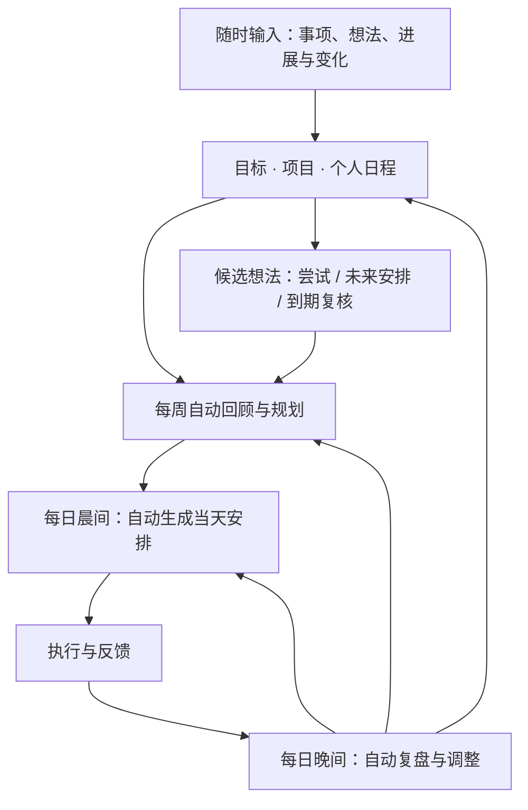

# bymyside

**让 AI 助手持续跟进你的目标、日程和想法。**

bymyside 是一个个人成长与陪伴工具，在你常用的 AI 办公 agent 中运行。它保存你的长期方向、当前事项和个人日程，自动完成晨间规划、晚间复盘与每周回顾，并根据你的反馈调整后续安排。

适合需要兼顾工作、学习、个人项目和生活，容易启动困难，或不想花太多精力维护计划的人。

[快速开始](#快速开始) · [功能](#功能) · [运行流程](#运行流程) · [常见问题](#常见问题)

## 为什么做 bymyside

AI 助手可以很快生成一份计划，但日常使用还需要解决这些问题：

- **“每天都在忙，长期想做的事一直没动。”** 需要把长期方向落实到每周和每天，为重要但不紧急的事留出时间。
- **“想到很多东西，记完就忘了。”** 想法需要后续评估和安排，而不只是多一条笔记。
- **“知道该做什么，就是开始不了。”** 需要结合当前状态缩小下一步，并在之后继续跟进。
- **“计划一变，又要重新解释和整理。”** 目标、日程和进展需要持续保存，变化后只调整受影响的部分。

bymyside 将这些工作交给助手维护。你可以随时输入事项、想法和变化；日常规划与回顾按约定自动运行。

## 功能

| 功能 | 能帮你做什么 |
|---|---|
| 自由记录 | 直接输入混合的待办、想法、担忧和参考资料，由助手整理；记录不等于新增承诺 |
| 日程导入 | 从文件、截图、文字或已授权日历整理工作、会议、课程及生活安排 |
| 目标与项目管理 | 保存长期方向、阶段里程碑和项目进展，将它们关联到周、日安排 |
| 想法落地 | 评估价值、时机与投入，安排一次尝试、未来窗口或复核时间 |
| 晨间规划 | 自动根据日程、周计划和最新进展生成当天安排 |
| 晚间复盘 | 自动回顾已知进展与阻碍，调整后续安排；回复可选 |
| 每周回顾与规划 | 自动检查阶段进展、剩余工作和候选想法，生成下一周安排 |
| 变化后重排 | 根据新增事项、进度和状态变化更新安排，中断后从现状继续 |

## 快速开始

### 1. 下载 ZIP

[**下载 ZIP**](https://github.com/leazihan/bymyside/archive/refs/heads/main.zip)，下载后解压。也可以点击本页上方 **Code → Download ZIP**。

### 2. 用 AI 助手打开文件夹

在常用的 AI 办公助手中选择“打开文件夹”，或新建项目并选择解压后的文件夹。打开后应能找到 `START_HERE.md`。

如果助手支持解压文件，也可以直接把 ZIP 交给它处理。

### 3. 复制这段话

```text
请读取 START_HERE.md，帮我配置 bymyside。
先检查你能否保存项目资料、设置并运行定时任务，
再引导我导入个人日程，记录当前目标和事项，
配置晨间规划、晚间复盘和每周回顾。
请和我确认时区、运行时间及结果接收位置。
```

接下来按助手提示提供日程、确认运行时间即可。日程可以是文件、截图，也可以直接描述固定安排；没有明确长期目标也能开始。

**配置完成后，每日和每周流程自动运行。** 如果平台要求点击确认，助手会指出需要完成的操作；缺少必要能力时，会说明具体哪一步暂时无法完成。

详细步骤与故障处理见 [开始使用](docs/getting-started.md)。

<details>
<summary>使用 Git 下载</summary>

从本页 **Code** 菜单复制仓库地址，将下面的 `REPOSITORY_URL` 替换为该地址：

```sh
git clone REPOSITORY_URL
```

然后用 AI 助手打开下载得到的文件夹，发送上面的初始化指令。

</details>

<details>
<summary>初始化会做什么？</summary>

1. 检查助手能否持久读写项目资料、设置定时任务并访问同一份记录。
2. 引导导入个人日程，核对时区、重复安排、例外和休息时间。
3. 记录当前目标、责任和想法，生成第一份近期安排。
4. 按确认的节奏创建晨间、晚间、每周任务，保存实际任务标识并回读检查。

已有记录和任务会先检查再更新，不重复初始化。平台要求的确认由用户完成；尚未创建或未实际触发的任务会如实标注状态。

</details>

## 运行流程

随时输入和定时任务共用一份项目记录。每周安排考虑长期方向，每日安排考虑实际日程，反馈再更新后续计划。



## 使用示例

平时直接对助手说：

- “这是我的日程表，周三晚上有课，九点之后要休息。”
- “以后想做一个读书网站，先记下来，看看什么时候适合试一下。”
- “方案一直没开始，今晚只有半小时。”
- “昨天完成了第一部分，今天临时多了一个会议，帮我调整。”

下面是一份**虚构的晨间安排示意**，用于说明输出形式：

> **周二安排**
>
> 本周重点是周五前提交方案，今天推进主要部分。
>
> | 时间 | 安排 | 预期结果 |
> |---|---|---|
> | 09:00–18:00 | 工作与会议 | 按已有日程进行 |
> | 18:00–19:00 | 通勤与晚饭 | 保留生活时间 |
> | 19:00–20:30 | 方案 P01 | 推进主要未完成部分，之后校准剩余量 |
> | 21:00 后 | 休息 | 不安排补做 |
>
> 读书网站保留为候选想法，周日评估尝试窗口。方案目前仍有工时不足的风险，今天的进展会用于调整周四安排。

更多场景见 [使用指南](docs/usage.md)，完整虚构资料见 [examples/memory](examples/memory)。

## 常见问题

### 可以用在哪些助手中？

不绑定特定品牌。平台需要能读取规则、持久保存项目记录、定时执行并访问同一份资料。日程文件解析和通知方式使用所在平台的能力。具体要求见 [平台与自动化说明](docs/compatibility.md)。

### 需要每天回复、每周手动触发吗？

不需要。晨间、晚间和每周流程按配置自动运行，必要时补充一句进展即可。没有回复的部分保持未知，不视为完成或失败。网络或调度中断时可以在对话中继续，恢复后按当前时间安排。

### 没有明确长期目标可以用吗？

可以。先从当前责任、日程和想法开始。助手可以提出方向建议，是否采纳由你决定。

### 会替我做任务，或直接改变日程吗？

默认负责规划、记录和进度跟踪。记录“我要写方案”不授权助手代写方案；导入日程也不默认修改外部日历。重要目标、承诺、期限和受保护生活时间的变更由你决定。

### 个人数据存在哪里？

使用记录保存在项目的 `.bymyside/`，已加入 Git 忽略规则。运行时相关资料会由所选 AI 平台处理；外部日历和消息渠道按授权使用。提交反馈时请使用虚构或脱敏资料，不上传私人工作区。

### 是否收费？

本项目按 MIT 许可证开源。运行所需的 AI 模型、办公 agent 或消息服务可能收费，以所选服务为准。

## 项目状态

作者已在日常使用中运行自动流程。当前公开版已由用户确认通过 Codex 测试，其他平台尚未逐一验证；试用步骤见 [首次试用清单](docs/first-user-trial.md)。

<details>
<summary>项目结构与维护</summary>

```text
START_HERE.md      由助手执行的初始化指引
skill/             共享规则、记录模板与可选归档工具
automations/       晨间、晚间和每周执行提示
examples/memory/   虚构示例资料
docs/              使用、兼容性与试用文档
```

日常记录由助手维护，用户无需手动编辑文件。更新规则后，自动任务需要加载同一版规则；切换平台时暂停旧任务并带走自己的记录，避免重复提醒。

</details>

## 反馈

欢迎反馈初始化卡点、规划遗漏、重复提醒或使用体验。请说明平台、预期行为、实际结果和复现方式，并删除身份信息、日程细节、消息标识与凭据。

## 许可证

[MIT](LICENSE) · Copyright © 2026 leazihan
